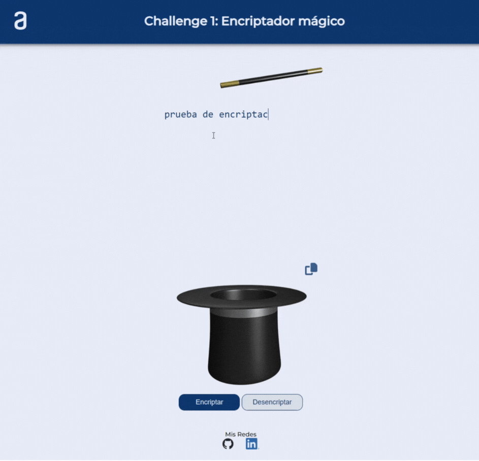

# Challenge-Oracle-ONE

Primer reto de Oracle ONE: Encriptador y desencriptador de textos.

## **Detalles**

Para este proyecto se creó un sistema de encriptación y desencriptación de textos customizados. Las reglas establecidas para este reto fueron las siguientes:

* El texto ingresado únicamente debe ser en minúsculas.
* No se aceptan acentos ni caracteres especiales.
* El sistema debe permitir encriptar y desencriptar el texto ingresado.
* Se proporciona un template base pero el desarrollo final puede ser a creatividad propia.
* Se toma como extra el añadir un botón de copiado al clipboard.
* Desplegar el producto final a GitHub Pages o similares.

## Encriptador mágico

Como producto final, decidí desarrollar una aplicación con animaciones para dar una experiencia de usuario diferente al template proporcionado. Como tema base tomé la mágia, haciendo uso de svg de una varita y un sombrero mágico.

Un preview del producto final:

Aplicación Live:

[Challenge Oracle ONE | Encriptador/Desencriptador](https://IvanAbadJC.github.io/Challenge-Oracle-ONE/index.html)
